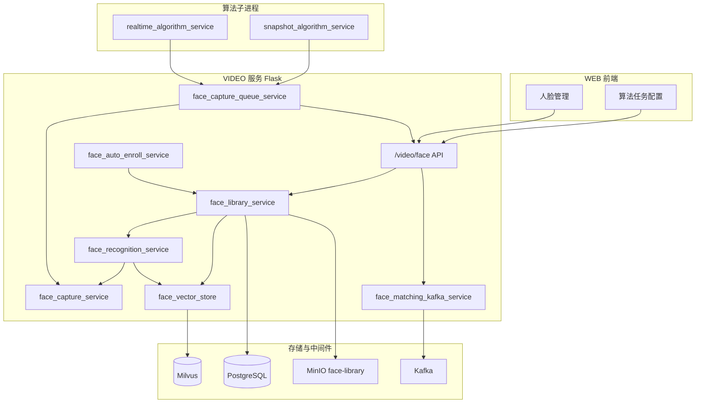
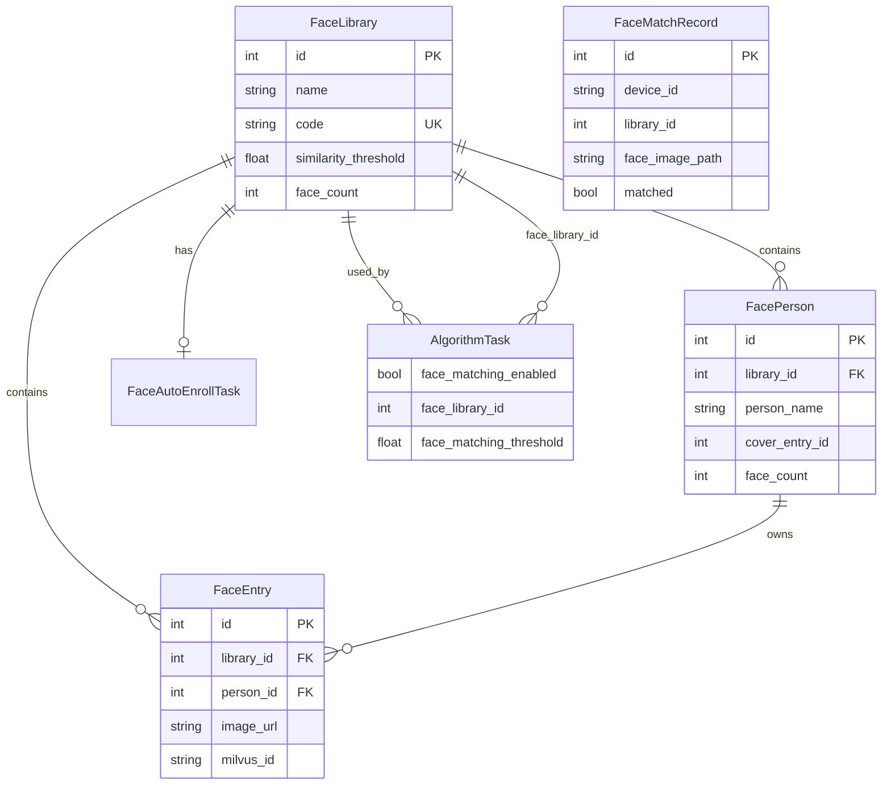

# VIDEO 人脸功能设计文档

> 版本：与当前代码库一致（`face_det.onnx` / `face_rec.onnx` + Milvus）  
> 路由前缀：`/video/face`  
> 相关测试：`test_face_pipeline.py`、`test_face_pipeline_README.md`

---

## 1. 概述

### 1.1 目标

在 EasyAIoT 的 **VIDEO** 模块中提供完整的人脸管理能力，包括：

| 能力 | 说明 |
|------|------|
| 人脸库管理 | 创建库、录入/更新/删除人脸、人员归一化（合并同一人多张照片） |
| 1:N 识别 | 上传图片或设备抓帧，在指定人脸库中检索最相似人员 |
| 算法任务联动 | 实时/抓拍算法任务开启「人脸匹配」后，从视频流异步抓脸并投递 Kafka |
| 自动录入 | 绑定摄像头，在限时内自动发现「库中不存在」的新人脸并入库 |
| 匹配记录 | 保存算法侧产生的匹配请求元数据，供前端查询 |

### 1.2 设计原则

- **检测与识别分离**：`face_det.onnx` 负责找脸；`face_rec.onnx` 负责提 512 维特征；**Milvus 只存向量、做检索**，不从图片直接识别人。
- **与主算法解耦**：视频流上的抓脸走独立队列，不阻塞 YOLO 检测、叠框、告警主链路。
- **业务数据在 PostgreSQL**：人脸库、人员、条目、匹配记录；**向量在 Milvus**；**展示用图片在 MinIO**（桶 `face-library`）。

---

## 2. 系统架构

### 2.1 逻辑分层



### 2.2 三条主链路

#### 链路 A：管理端录入 / 识别（同步 HTTP）

```
上传图片 → face_det 检测 → 裁脸 → face_rec 提特征 → Milvus 写入/检索
         → 原图/裁剪图上传 MinIO → FaceEntry / FacePerson 写 PostgreSQL
```

#### 链路 B：算法任务实时抓脸（异步，不阻塞主流程）

```
视频帧 → 主算法线程 copy 帧 → face_capture 队列
      → Worker: face_det → 保存裁剪图到 data/face_images/...
      → HTTP POST /video/face/matching/publish → Kafka(iot-face-matching)
      → （可选）外部消费端再调 /matching/process 写匹配记录
```

#### 链路 C：摄像头自动录入（定时调度）

```
run.py 调度器 tick → 轮询摄像头抓帧 → 检测+匹配库
                  → 未命中则 add_entry 入库
```

---

## 3. 模型与文件

### 3.1 固定模型（VIDEO 根目录）

| 文件 | 大小约 | 作用 | 配置项 |
|------|--------|------|--------|
| `face_det.onnx` | ~43MB | YOLO 头部/人脸检测，算法抓脸 + 识别前检测 | `FACE_CAPTURE_MODEL_PATH` |
| `face_rec.onnx` | ~167MB | ArcFace 特征（原 InsightFace buffalo_l 的 `w600k_r50.onnx`） | `FACE_MATCH_MODEL_PATH` |

路径定义见：`app/utils/face_model_paths.py`。

### 3.2 模型来源说明

- **`face_det.onnx`**：项目提交中自带的头部检测 ONNX（曾用名 `face_capture_head_yolov8.onnx`）。
- **`face_rec.onnx`**：InsightFace **buffalo_l** 套件中的识别模型，仅保留识别权重单文件；检测不再依赖 buffalo_l 的 `det_10g.onnx`，统一用 `face_det.onnx`。

若新环境缺少模型，可：

```bash
# 使用 insightface 下载 buffalo_l 后复制识别模型
python3 -c "from insightface.app import FaceAnalysis; FaceAnalysis(name='buffalo_l', root='./_dl'); FaceAnalysis(name='buffalo_l', root='./_dl').prepare(ctx_id=-1)"
cp ./_dl/models/buffalo_l/w600k_r50.onnx ./face_rec.onnx
```

### 3.3 特征提取流程（`face_recognition_service`）

1. `detect_faces()`（`face_capture_service`）→ 得到 `bbox` 列表。  
2. 按框裁剪人脸区域，resize 到模型 `input_size`（112×112）。  
3. `ArcFaceONNX.get_feat()` → L2 归一化 → **512 维** `float32` 向量。  
4. 向量写入 Milvus 或用于 `search_embedding`。

> **为何需要本地提特征？** Milvus 是向量数据库，只接受已算好的 embedding，不提供「图片 → 向量」能力。

---

## 4. 数据模型

### 4.1 PostgreSQL（`models.py`）



| 表 | 说明 |
|----|------|
| `face_library` | 人脸库；`similarity_threshold` 为默认匹配阈值（建议 0.50~0.70） |
| `face_person` | 归一化后的「人员」，可有多张 `face_entry` |
| `face_entry` | 单张人脸照片；`milvus_id` 对应 Milvus 主键 |
| `face_auto_enroll_task` | 自动录入配置与运行状态 |
| `face_match_record` | 算法/Kafka 侧匹配请求记录 |
| `algorithm_task` | `face_matching_enabled`、`face_library_id`、`face_matching_threshold` |

### 4.2 Milvus（`face_vector_store`）

- **集合名**：`FACE_MILVUS_COLLECTION`（默认 `face_embeddings`）
- **URI**：`MILVUS_URI`（默认 `http://localhost:19530`）
- **维度**：512
- **度量**：内积 `IP`（向量已 L2 归一化时，等价于余弦相似度）
- **索引**：`IVF_FLAT`，`nlist=128`；搜索 `nprobe=16`

| 字段 | 类型 | 说明 |
|------|------|------|
| `id` | INT64 PK | 自增，即 `FaceEntry.milvus_id` |
| `library_id` | INT64 | 检索时按库过滤 |
| `face_entry_id` | INT64 | 关联业务条目 |
| `label` / `person_name` / `person_code` | VARCHAR | 冗余便于查询 |
| `embedding` | FLOAT_VECTOR(512) | 特征向量 |

### 4.3 MinIO

- **桶名**：`FACE_IMAGE_BUCKET`（默认 `face-library`）
- **对象路径**：`{library_id}/{uuid}.jpg`
- **公开 URL**：由 `MINIO_PUBLIC_ENDPOINT` 或 `MINIO_ENDPOINT` 拼接

### 4.4 算法任务本地人脸图

- **目录**：`FACE_IMAGES_DIR`，默认 `VIDEO/data/face_images/`
- **结构**：`task_{taskId}/{deviceId}/matching/{timestamp}_frame{n}_track{id}_face.jpg`

---

## 5. 模块职责

| 模块 | 路径 | 职责 |
|------|------|------|
| `face_model_paths` | `app/utils/face_model_paths.py` | 模型路径常量 |
| `face_capture_service` | `app/utils/face_capture_service.py` | 加载 `face_det`，单帧检测 |
| `face_capture_queue_service` | `app/utils/face_capture_queue_service.py` | 抓脸队列、落盘、调 publish API |
| `face_recognition_service` | `app/services/face_recognition_service.py` | 检测+特征+封装识别 API |
| `face_vector_store` | `app/services/face_vector_store.py` | Milvus CRUD / 检索 |
| `face_library_service` | `app/services/face_library_service.py` | 库/人/条目业务、归一化、匹配 |
| `face_matching_kafka_service` | `app/services/face_matching_kafka_service.py` | 组装消息、发 Kafka |
| `face_auto_enroll_service` | `app/services/face_auto_enroll_service.py` | 自动录入 tick |
| `face` Blueprint | `app/blueprints/face.py` | HTTP 路由 |

---

## 6. 业务流程

### 6.1 人脸入库（`add_entry`）

1. 解码上传图片。  
2. `extract_and_crop_largest_face`：检测 → 取最大脸 → 裁剪。  
3. 裁剪图上传 MinIO，创建 `FaceEntry` / `FacePerson`。  
4. `add_face_to_library`：对裁剪图提特征 → `insert_embedding` → 回写 `milvus_id`。  
5. 更新库/人员 `face_count`。

### 6.2 图片识别（`recognize` / `match`）

1. 对图中每张脸提特征。  
2. `search_embedding(embedding, library_id=..., top_k=...)`。  
3. `similarity >= threshold` 判为命中（阈值：请求参数 > 人脸库默认 > `FACE_SIMILARITY_THRESHOLD`）。

### 6.3 算法任务人脸匹配

**前置条件**（`AlgorithmTask`）：

- `face_matching_enabled = true`
- `face_library_id` 已配置
- 任务类型为 `realtime` 或 `snap`

**运行时**（`run_deploy.py`）：

1. 任务启动时若开启匹配 → `start_face_capture_workers`。  
2. 每帧处理中调用 `try_send_face_matching_for_frame` → 非阻塞 `enqueue_face_capture`。  
3. Worker 检测人脸 → 保存 jpg → `POST /video/face/matching/publish`。  
4. `send_face_matching_to_kafka` → 主题 `KAFKA_FACE_MATCHING_TOPIC`（默认 `iot-face-matching`）。

**阈值解析顺序**：

1. `algorithm_task.face_matching_threshold`  
2. 关联 `face_library.similarity_threshold`  
3. 环境变量 `FACE_SIMILARITY_THRESHOLD`

### 6.4 Kafka 异步匹配（设计意图）

| 步骤 | 组件 | 说明 |
|------|------|------|
| 生产 | VIDEO `matching/publish` | 算法进程 HTTP 触发，消息含 `faceImagePath`、`libraryId` 等 |
| 消费 | 外部服务（如 iot-sink） | 订阅 `iot-face-matching`，读本地脸图，调 VIDEO 做向量检索 |
| 落库 | `POST /video/face/matching/process` | 当前实现：写入 `FaceMatchRecord` 元数据 |
| 结果 | `KAFKA_FACE_MATCHING_RESULT_TOPIC` | 可扩展：回写命中结果、联动告警 |

> **现状说明**：`process_face_matching_message` 目前主要**记录请求**，不在此接口内完成向量比对；完整比对可由消费端调用 `/libraries/{id}/match` 或扩展 `process` 实现。

### 6.5 人员归一化

- **预览**：`preview_normalize_groups` — 拉取库内 Milvus 向量，两两算相似度，并查聚类建议合并组。  
- **合并**：`merge_persons` / `merge_face_entries` / `merge_all_normalize_groups` — 将多人员/多条目归并，保留全部照片与向量。

### 6.6 自动录入（`face_auto_enroll_service`）

- `run.py` 中 APScheduler 周期调用 `tick_auto_enroll_tasks`。  
- 对每个 `is_running` 任务：按 `capture_interval_sec` 轮询 `device_ids` 抓帧。  
- 若在当前库**匹配未命中** → `add_entry` 自动创建人员（名称 `{prefix}-{序号}`）。  
- 到期或手动 `stop` 结束。

---

## 7. HTTP API 清单

基础路径：**`/video/face`**

### 7.1 健康与库管理

| 方法 | 路径 | 说明 |
|------|------|------|
| GET | `/health` | Milvus 连通性（向量库） |
| GET/POST | `/libraries` | 列表 / 创建人脸库 |
| GET/PUT/DELETE | `/libraries/{id}` | 详情 / 更新 / 删除 |
| GET | `/libraries/{id}/entries` | 条目列表 |
| GET | `/libraries/{id}/persons` | 归一化人员分页 |
| POST | `/libraries/{id}/entries` | 单条录入（multipart `file`） |
| POST | `/libraries/{id}/entries/batch` | 批量录入 |
| POST | `/libraries/{id}/match` | 上传图片在库内匹配 |

### 7.2 人员与条目

| 方法 | 路径 | 说明 |
|------|------|------|
| GET/DELETE | `/persons/{id}` | 人员详情 / 删除 |
| POST | `/persons/batch-delete` | 批量删除人员 |
| PUT | `/persons/{id}/cover` | 设置封面条目 |
| PUT/DELETE | `/entries/{id}` | 更新 / 删除条目 |

### 7.3 归一化与自动录入

| 方法 | 路径 | 说明 |
|------|------|------|
| GET | `/libraries/{id}/normalize/preview` | 相似分组预览 |
| POST | `/libraries/{id}/normalize/merge` | 手动合并 |
| POST | `/libraries/{id}/normalize/merge-all` | 按预览批量合并 |
| GET/PUT | `/libraries/{id}/auto-enroll` | 自动录入配置 |
| POST | `/libraries/{id}/auto-enroll/start` | 启动 |
| POST | `/libraries/{id}/auto-enroll/stop` | 停止 |

### 7.4 算法 / Kafka

| 方法 | 路径 | 说明 |
|------|------|------|
| POST | `/matching/publish` | 算法进程投递 Kafka |
| POST | `/matching/process` | 消费端写匹配记录 |
| GET | `/matching/records` | 匹配记录分页 |

### 7.5 兼容旧版单库 API

| 方法 | 路径 | 说明 |
|------|------|------|
| GET/POST | `/library` | 按 label 列表 / 录入 |
| PUT/DELETE | `/library/{label}` | 更新 / 删除 |
| POST | `/recognize/image` | 图片识别 |
| POST | `/recognize/device/{device_id}/snapshot` | 设备抓帧识别 |

---

## 8. 配置项

详见 `env.example`。

### 8.1 模型

```ini
# FACE_CAPTURE_MODEL_PATH=./face_det.onnx
# FACE_MATCH_MODEL_PATH=./face_rec.onnx
FACE_CAPTURE_CONF_THRESHOLD=0.45
FACE_CAPTURE_IOU_THRESHOLD=0.5
```

### 8.2 抓脸队列

```ini
FACE_CAPTURE_QUEUE_SIZE=8
FACE_CAPTURE_WORKER_THREADS=1
FACE_CAPTURE_KEEP_LATEST=true
FACE_CAPTURE_KEEP_LATEST_THRESHOLD=4
FACE_IMAGES_DIR=./data/face_images
```

### 8.3 Milvus / 匹配

```ini
MILVUS_URI=http://localhost:19530
FACE_MILVUS_COLLECTION=face_embeddings
FACE_SIMILARITY_THRESHOLD=0.55
```

### 8.4 Kafka

```ini
KAFKA_FACE_MATCHING_TOPIC=iot-face-matching
KAFKA_FACE_MATCHING_RESULT_TOPIC=iot-face-matching-result
```

### 8.5 MinIO

```ini
FACE_IMAGE_BUCKET=face-library
MINIO_ENDPOINT=...
MINIO_PUBLIC_ENDPOINT=...
```

### 8.6 GPU

```ini
USE_GPU=false
# 为 true 时 face_rec 优先 CUDAExecutionProvider
```

---

## 9. 依赖与部署

### 9.1 Python 依赖（`requirements-base.txt`）

- `insightface` — 加载 `face_rec.onnx`（ArcFaceONNX）
- `onnxruntime` / `onnxruntime-gpu` — 推理
- `opencv-python`、`numpy`
- `pymilvus` — Milvus 客户端

### 9.2 中间件

| 组件 | 用途 |
|------|------|
| PostgreSQL | 业务表 |
| Milvus 2.x | 向量库（gRPC 19530） |
| MinIO | 人脸图片 |
| Kafka | 算法异步匹配（可选） |

### 9.3 部署检查清单

- [ ] `VIDEO/face_det.onnx`、`VIDEO/face_rec.onnx` 已放置  
- [ ] Milvus 可访问，`MILVUS_URI` 正确  
- [ ] MinIO 桶 `face-library` 可写  
- [ ] 算法任务机器能访问 VIDEO 的 `/video/face/matching/publish`（网关或 `localhost:6000`）  
- [ ] 开启人脸匹配的算法任务已选 `face_library_id`  
- [ ] `data/face_images` 目录有写权限  

### 9.4 注册入口

- Blueprint：`run.py` → `app.register_blueprint(face.face_bp, url_prefix='/video/face')`
- 自动录入调度：`run.py` APScheduler `face_auto_enroll_tick`

---

## 10. 前端与其它模块

| 模块 | 路径 | 说明 |
|------|------|------|
| WEB 人脸管理 | `WEB/src/views/face-manage/` | 库、人员、录入、归一化 |
| WEB API | `WEB/src/api/device/face_library.ts` | 封装 `/video/face` |
| 算法任务弹窗 | `WEB/.../AlgorithmTaskModal.vue` | `face_matching_enabled`、`face_library_id` |
| 实时算法 | `services/realtime_algorithm_service/run_deploy.py` | 抓脸队列、publish |
| 抓拍算法 | `services/snapshot_algorithm_service/run_deploy.py` | 同上 |

---

## 11. 测试

```bash
cd VIDEO
pip install requests
python test_face_pipeline.py \
  --register 张三=./test_data/face/zhangsan_1.jpg \
  --recognize 样本=./test_data/face/zhangsan_2.jpg \
  --cleanup
```

覆盖：健康检查、旧版 `/library` CRUD、图片识别。新人脸库 API 可通过前端或 Postman 按第 7 节测试。

---

## 12. 相似度与阈值

- Milvus 返回的 `distance` 在内积 metric 下即为**相似度**（越大越像）。  
- 推荐默认：**0.55**；光照差、侧脸多时可降至 **0.50**；高安全场景可升至 **0.60~0.70**。  
- 阈值可在三级覆盖：环境变量 → 人脸库 → 算法任务。

---

## 13. 已知限制与后续扩展

| 项 | 说明 |
|----|------|
| Kafka `process` 接口 | 当前仅落库 `FaceMatchRecord`，未内置自动向量比对 |
| Milvus 更新 | `update_face_entry_id` 仅打日志，改条目需删向量重建 |
| 特征对齐 | 裁剪图直接 resize 到 112×112，未做人脸关键点对齐，极端侧脸精度低于完整 InsightFace 流水线 |
| 删除一致性 | 删条目时需同时删 Milvus + MinIO（`face_library_service` 已处理，注意异常回滚） |
| 扩展建议 | 在 iot-sink 消费 Kafka 后调用 `match_face_in_library` 并回写 `matched_*` 字段；或增强 `matching/process` |

---

## 14. 目录结构速查

```
VIDEO/
├── face_det.onnx              # 人脸检测
├── face_rec.onnx              # 特征提取
├── FACE_DESIGN.md             # 本文档
├── app/
│   ├── blueprints/face.py
│   ├── services/
│   │   ├── face_library_service.py
│   │   ├── face_recognition_service.py
│   │   ├── face_vector_store.py
│   │   ├── face_matching_kafka_service.py
│   │   └── face_auto_enroll_service.py
│   └── utils/
│       ├── face_model_paths.py
│       ├── face_capture_service.py
│       └── face_capture_queue_service.py
├── data/face_images/          # 算法裁剪脸图（默认）
├── test_face_pipeline.py
└── services/
    ├── realtime_algorithm_service/run_deploy.py
    └── snapshot_algorithm_service/run_deploy.py
```

---

## 15. 修订记录

| 日期 | 说明 |
|------|------|
| 2026-06-01 | 初版：单文件模型布局、Milvus 分工、全链路 API 与算法/Kafka 设计 |
